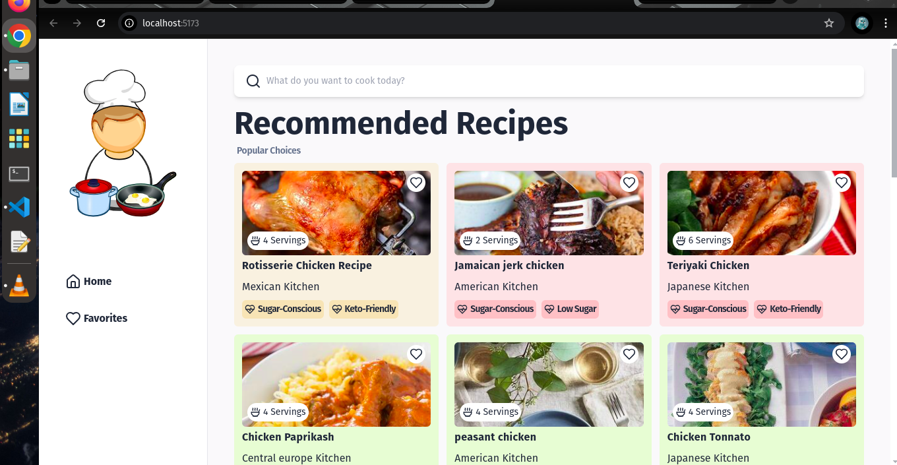
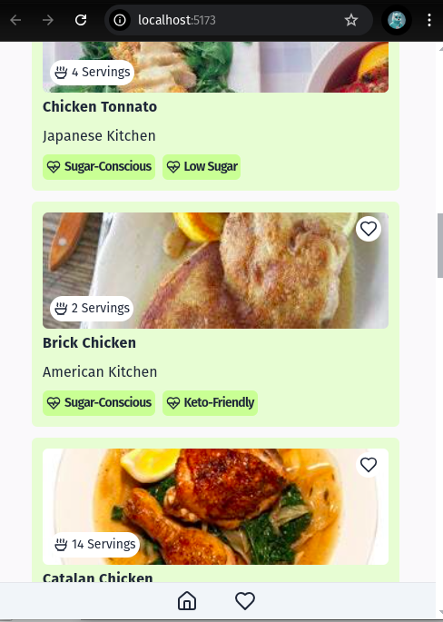

# Ingredu

Ingredu is a recipe finder application that allows users to search for recipes using the Edamam API. It provides detailed recipe information and links to YouTube for cooking videos, while also enabling users to save their favorite recipes locally.

## Screenshots

Here are some screenshots of the application:




## Features

 - Search for a wide variety of recipes using the Edamam Recipe API.
 - View essential details like health labels, cuisine type, and   servings.
 - Favorite recipes and store them locally in your browser.
 - Redirect to YouTube for recipe preparation videos.

# Installation

1. Clone the repository:
   ```bash
   git clone https://github.com/yourusername/Ingredu.git
   cd Ingredu

2. Install dependencies:

    ```bash
    npm install

3. Set up environment variables: Create a `.env` file in the root directory and add your Edamam API keys. You can obtain free API keys by signing up or logging in at [Edamam Developer Login](https://developer.edamam.com/login):

    ```bash
    VITE_APP_ID=your_app_id
    VITE_APP_KEY=your_app_key

4. Run the development server:

    ```bash
    npm run dev

# Usage

 - Enter a recipe or ingredient into the search bar to find related recipes.
 - Click on a recipe to view details like servings and health labels.
 - Click on the YouTube link to watch a video tutorial on preparing the dish.
 - Add recipes to your favorites for easy access later.


Feel free to adjust this based on your exact preferences!
